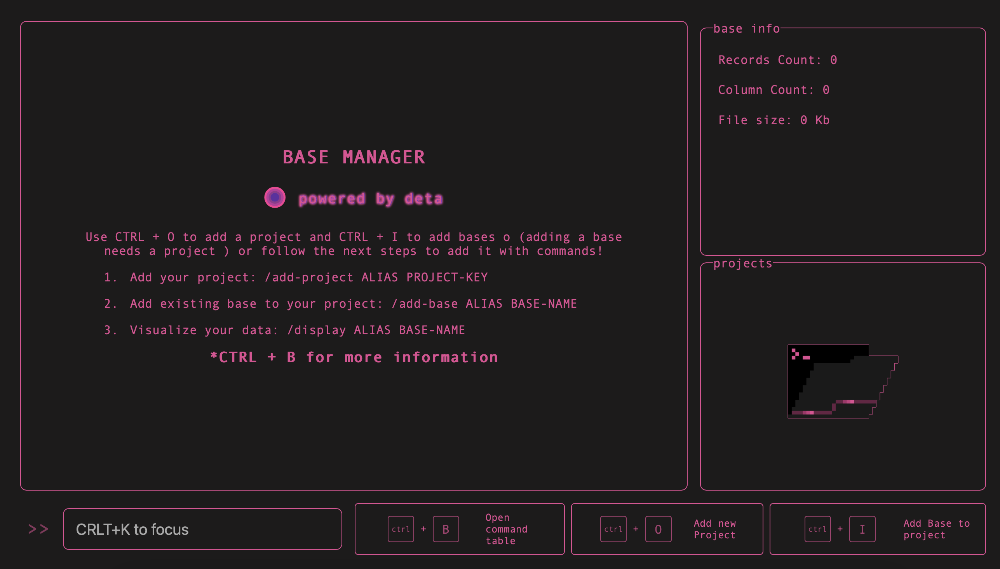
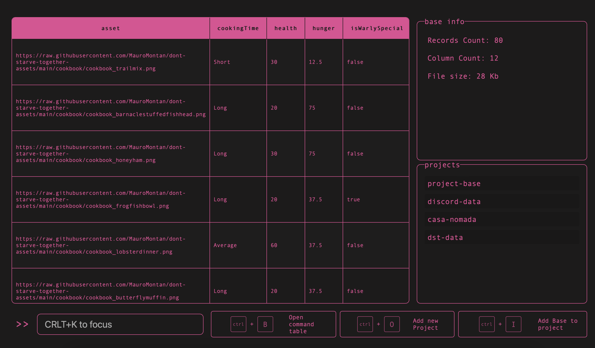
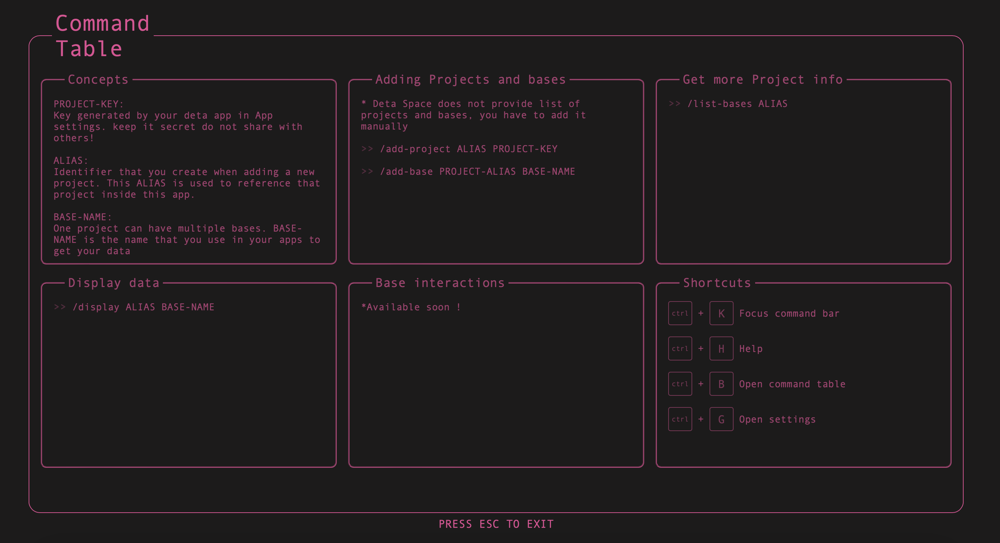

# Base Manager

✨ Deta Space Base Manager for multiple projects and bases

## About App Interface

Although the interface is designed to be used with commands, you can use your mouse to interact with the app. Adding projects and bases can be executed only with commands.

Empty Homepage

Homepage with data added

### Command bar and Shortcuts

The commands and shortcuts are made to do anything in the app from navigation to interacting with your projects and bases. consult the command table by pressing crtl + B

## First Steps

You can start by adding one project to your app. Remember that your project need to have data on it.

- Generate or use a project key provided by your app settings
- Add your project to base manager by typing `/add-project <PROJECT-ALIAS> <PROJECT KEY>` in the command bar. ALIAS is a name you give to your app to reference that project
- If you find hard to remember your base names you can add all your base names to a list related to your project by typing `/add-base <PROJECT-ALIAS> <BASE-NAME>`
- Finally display your base data with `/display <PROJECT-ALIAS> <BASE-NAME>` or click in your project list and click in your base.
